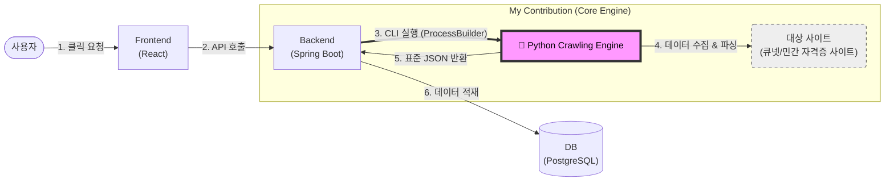

# Crawling Engine (Python)

공공/민간 자격증 사이트의 정보를 자동 수집·정규화하여 **표준 JSON 산출물**을 생성하는 크롤링 엔진입니다.  
운영 관점에서 **실패 제어(타임아웃/재시도/스냅샷)와 로그 기반 재현/트러블슈팅**을 우선해 설계했습니다.

Pipeline: fetch → parse → normalize → output(JSON)

## 👨‍💻 Core Contributions (기여도)
- **Lead Developer ([Lee_Jihoon])**: 
    - 프로젝트 전체 아키텍처 설계 및 핵심 크롤링 엔진 로직 구현 (전체 코드의 95% 이상 담당)
    - 600개 이상의 자격증 사이트 대응을 위한 다중 규칙 엔진 개발
    - Docker 기반 통합 인프라 및 운영 환경 구축 (PostgreSQL, Selenium Grid 최적화)

> [!IMPORTANT]
> ### 📢 Notice: Intellectual Property Protection (Patent Pending)
> * 본 프로젝트에 적용된 **'비정형 데이터 대응 다중 규칙 엔진'** 로직은 현재 **특허 출원 절차를 진행 중**에 있습니다.
> * 600개 이상의 자격증 사이트(Q-Net 등)의 각기 다른 구조를 통합 처리하는 독자적인 기술이 포함되어 있으며, 무단 도용 및 상업적 이용을 금합니다.

## 프로젝트 개요
- 자격증 정보가 여러 사이트에 분산되어 있어 관리가 어렵다는 문제에서 출발
- 공공/민간 자격증 데이터를 표준 JSON 구조로 통합
- 실패 제어와 재처리를 고려한 크롤링 파이프라인 설계

## 결과물
- 결과물은 별도의 작업 루트(`--root`) 아래에 생성됩니다.
  - 예: `Certificate_api/1320/1320.norm.json`


## 설계 포인트
- 공공(Q-Net) / 민간 사이트 **구조 차이를 파이프라인 수준에서 분리**해 확장성 확보
- adapter/util 계층으로 규칙을 분리해 **유지보수성과 데이터 품질**을 우선
- **타임아웃·재시도·스냅샷(HTML 저장)·중복 제거**로 실패 케이스 제어

## 코드 읽기 가이드
- `public_cert_api/` : 공공(Q-Net) 크롤러 모음
- `private-cert-crawl/` : 민간/사설 크롤러 모음

## 보안
- 쿠키/토큰/계정정보는 저장소에 커밋하지 않습니다. (`cookies.txt`, `.env` 등은 `.gitignore` 처리)
- 과도한 트래픽을 유발하지 않도록 요청 간격/재시도를 제한합니다.


---

## 상세 설계 배경 및 문제 해결 과정

### 1. 프로젝트 시작 배경

큐넷, 자격증넷 등 기존 자격증 사이트들은 일정, 시험 정보, CBT 기능이 각각 분산되어 있어,
사용자가 관심 있는 자격증만을 모아 한눈에 관리하기 어렵다는 불편함이 있었습니다.

그래서 팀원들과 논의한 끝에 단순히 정보를 모으는 것을 넘어 데이터를 정규화하고,
인프라를 직접 구축해보는 것을 겪어보고 싶은 바램을 바탕으로

자격증 일정·시험 정보·CBT·즐겨찾기 기능을 하나의 서비스로 통합해
제공하자는 결론에 도달했고, 이를 졸업작품 주제로 선정했습니다.

---

### 2. 문제 ① 크롤링 파이프라인 설계

가장 처음 마주한 문제는 크롤링 자체가 아니라,
**"인터넷에 흩어진 정보를 어떤 구조로 수집·정리할 것인가"**였습니다.

이에 따라  
**fetch(HTML 수집) → parse(JSON 변환) → normalize(정규화 및 DB 적재)**  
라는 공통 파이프라인을 기준으로 전체 구조를 설계했습니다.

또한 사이트별 HTML 규칙 차이를 흡수하기 위해 adapter 계층을 두고,
불필요한 문자 제거·빈 값 처리·형식 통일과 같은 공통 작업은
util 스크립트로 분리해 관리했습니다.

---

### 3. 문제 ② 공공·민간 자격증 데이터 구조 차이

공공 자격증(큐넷)과 민간 자격증 사이트는 데이터 구조와 신뢰도 측면에서 성격이 크게 달랐습니다.

이 문제를 해결하기 위해 공공 자격증과 민간 자격증을
동일한 규칙으로 처리하지 않고, 파이프라인 수준에서 분리하는 설계를 선택했습니다.

민간 자격증은 비교적 구조가 안정적인 만큼 자동화 비중을 높였고,
큐넷의 경우에는 자동화 가능한 영역과 수작업 검증이 필요한 영역을 구분해 접근했습니다.

그 결과 약 **80~90%** 수준의 데이터 정합성을 확보했고,
완벽한 자동화보다 운영 가능성과 데이터 품질을 우선하는 방향으로
구현 범위를 설정했습니다.

모든 것을 자동화하고 싶단 큰 포부를 가지고 임했지만, 큐넷의 불규칙한 데이터 구조를 마주하고
고민한 끝에 **완벽한 자동화보단 데이터의 품질**이 우선이라 깨달았고, 그에 따라 복잡한 아키텍쳐 설계 과정에서 GPT와 치열하게 논의했습니다. AI가 바라는 효율적인 코드와 제가 생각하는 유지보수성 사이에서 균형을 맞추면 도구를 제어하고 최종 의사 결정을 내리는 엔지니어의 역할을 익혔습니다.


### 4. 문제 ③ 크롤링 엔진 활용
전체 서비스 중 **Core Crawling Engine(Python)** 부분을 전담하여 개발했습니다.  
Spring Boot와 **ProcessBuilder(CLI)** 방식으로 연동되며, 온디맨드(On-demand) 요청 시 실행됩니다.



### 4-2. 문제 ④: 파싱 엔진 고도화 및 데이터 무결성 확보

9개의 민간 자격증과 큐넷의 공공 자격증 파이프라인의 데이터 정밀도와 시스템 성능을 개선하기 위해 진행한 리팩토링 과정입니다. 단순히 코드를 고치는 것을 넘어, 환경 간의 간섭을 최소화하고 데이터 품질을 표준화하는 데 집중했습니다.

* **현상 및 기술적 부채 (Technical Debt)**
   - **파싱 병목 현상**: 기존 html.parser 엔진이 대용량 DOM 구조를 처리할 때 발생하는 성능 저하 및 특수 태그 해석 오류 확인

   - **데이터 오염 잔존**: 공공/민간 사이트의 비정형 HTML 구조에서 유입되는 불필요한 태그, 특수문자, 비정상 공백이 최종 JSON 결과물에 포함되어 데이터 품질 저해

* **엔지니어링적 해결 (Engineering Solutions)**

   - **범용 파싱 엔진(lxml) 도입**: 공공/민간 크롤러 전체에 lxml 엔진을 전격 적용하여 파싱 속도를 최적화하고 예외적인 태그 구조에 대한 유연한 대응력 확보

   - **중앙 집중형 정제 모듈(민간) 구축**: engine_common/utils_text.py 내에 독립적인 sanitize_text 함수를 설계. 이를 통해 모든 하위 모듈이 동일한 정제 규칙을 따르도록 중앙 제어형 아키텍처 구현

   - **공공 파이프라인(Q-Net) 고도화**: 공공 자격증 핵심 로직인 parse_tabs_min.py 내에 sanitize_text를 통합 적용하여, 수십 개의 시험 탭에서 추출되는 텍스트의 품질을 일괄적으로 정규화 

   - **민간 파이프라인 전면 리팩토링**: 9개 민간 자격증 개별 크롤러의 get_text 옵션을 표준화하고, 2중 필터링 로직을 이식하여 산출물 데이터의 무결성(Data Integrity) 달성


* **점진적 리팩토링 전략 (Incremental Refactoring)**

  - **통합 표준화** : 서로 다른 구조를 가진 공공/민간 프로젝트가 engine_common 유틸리티를 공유하게 함으로써 **코드 중복 제거 및 유지보수성 극대화**

  - **환경 간 일관성 검증**: Fedora(Linux)와 Windows 환경 모두에서 동일한 정제 결과가 산출되도록 환경 종속성을 제거하고 전수 테스트 통과


**"단순한 크롤링을 넘어, 공공과 민간의 데이터 파이프라인을 하나의 정제 표준으로 통합함으로써 시스템의 확장성과 데이터 신뢰성을 동시에 확보했습니다."**


## 5. Docker 기반 통합 인프라 및 멀티 플랫폼 지원

본 프로젝트는 단순한 코드 구현을 넘어, **'어떤 환경에서도 즉시 배포 및 실행 가능한 엔진'**을 구축하기 위해 Docker 기반의 통합 인프라를 도입했습니다. 이를 통해 Windows와 Linux 사이의 환경 의존성 문제를 완벽히 해결했습니다. 

| 항목 | 상세 내용 |
| :--- | :--- |
| **지원 OS** | Windows 10/11 (Docker Desktop), Fedora Linux (Docker Engine) |
| **인프라 표준화** | Docker Image를 통한 라이브러리 파편화 및 `psycopg2-binary==2.9.11` 적용으로 OS별 라이브러리 충돌 해결 |
| **리소스 최적화** | Shared Memory (2GB) 할당으로 대용량 자격증 페이지 수집 안정성 확보 |
| **구조적 유연성** | Host Volume Binding을 통해 기존 폴더 구조를 유지하며 컨테이너와 데이터 동기화 |
| **검증 완료** | 공공(Q-Net) 및 민간(KAIT) 자격증 데이터 정규화 테스트 통과  |

* **주요 엔지니어링 의사결정 (Decision & Rationale)**
  - **설계의 일관성**: 프로젝트의 기존 폴더 및 파일 구조를 강제로 변경하지 않고, docker-compose.yml의 볼륨 매핑 기능을 정교하게 설계하여 호스트의 소스를 컨테이너 내부 경로로 직접 연결했습니다. 이는 개발 생산성을 유지하면서도 운영 환경의 독립성을 확보한 핵심 전략입니다.
  - **환경의 제약 극복**: 리눅스(Fedora) 환경의 엄격한 보안 정책(SELinux)을 고려하여 :Z 플래그를 도입했고, 크롬 브라우저의 고질적인 메모리 부족(Tab Crashed) 문제를 인프라 레벨(shm_size)에서 근본적으로 해결했습니다.

단순히 작동하는 코드가 아니라, 어떤 운영환경(LINUX)에서도 돌아가게 만드는 엔진에 집중했습니다.
특히 윈도우와 페도라 사이의 라이브러리 충돌(psycopg2-binary)을 해결하며, 인프라 환경에 따른 
의존성 관리의 중요성을 배웠습니다.

---

> **이 프로젝트는 단순히 데이터를 긁어오는 도구가 아닙니다. 윈도우에서 개발하고 리눅스 서버에 배포하는 실제 현업의 파이프라인을 Docker로 표준화하여, **'명령어 단 한 줄'**로 모든 가동이 가능하게 만든 엔지니어링의 결과물입니다."**


## 6. 환경 설정 가이드 (Environment Setup)

본 프로젝트는 원활한 개발 및 운영을 위해 두 가지 실행 환경을 제공합니다. 

* **Option 1 (가상환경):** 코드 수정 및 로컬 테스트 등 **개발 단계**에서 빠른 피드백을 위해 사용합니다.
* **Option 2 (Docker):** 실제 운영 환경과 동일한 조건에서 **엔진을 시연하거나 배포**할 때 사용하며, 환경 의존성 없이 즉시 실행 가능합니다. (권장)

## 1. Linux (Fedora 기준)
1. **시스템 패키지 설치**
   ```bash
   sudo dnf install gcc postgresql-devel
   ```

2. **가상환경 구축 및 의존성 설치**
   ```bash
   python3 -m venv .venv
   source .venv/bin/activate
   python -m pip install --upgrade pip
   pip install -r requirements.txt
   ```

3. **가상환경 활성화**
   ```bash
   source .venv/bin/activate
   ```

   3-1. **엔진 실행(가상환경에서 공공 자격증 추출)**
        ```bash
        python -m public_cert_api.run_public --root "../cert_data" --jmcd 1320 --mode http
        ```
     
   3-2. **엔진 실행(가상환경에서 민간 자격증 추출)**
        ```bash
        #예를 들어 자격증 이름 = linux_master
        python run_once.py --cert [자격증이름] --config private-cert-crawl/configs/cert_map.yaml
        ```

4. **도커 설치(Linux 기준)**
   ```bash
   # 1. Docker 및 Docker Compose 설치
   sudo dnf install -y docker docker-compose

   # 2. Docker 서비스 시작 및 부팅 시 자동 실행 설정
   sudo systemctl start docker
   sudo systemctl enable docker

   # 3. (선택) sudo 없이 도커 사용을 위한 사용자 그룹 추가
   sudo usermod -aG docker $USER
   # 이후 로그아웃 후 다시 로그인해야 적용됩니다.
   ```

5. **엔진 빌드 (최초 1회 또는 코드 수정 시)**
   ```bash
   docker compose build
   ```

6. **엔진 실행 (도커에서 공공 자격증 추출)**
   ```bash
   # -m 옵션을 사용하여 모듈 단위로 실행하며, .py 확장자는 생략합니다.
   docker compose run --rm public-engine python -m public_cert_api.run_public --root /cert_data --jmcd 1320 --mode http
   ```

7. **엔진 실행(도커에서 민간 자격증 추출)**
   ```bash
   docker compose run --rm private-engine python -m run_once --cert [자격증이름]
   ```

## 1. Windows
1. **Python 설치**
   ```bash
   winget install Python.Python.3.11
   ```

2. **가상환경 구축 및 의존성 설치**
   ```bash
   python -m venv .venv
   .\.venv\Scripts\Activate.ps1
   python -m pip install --upgrade pip
   python -m pip install -r requirements.txt
   ```

3. **가상환경 활성화**
   ```bash
   .\.venv\Scripts\activate
   ```
   
   3-1. **엔진 실행(가상환경에서 공공 자격증 추출)**
        ```bash
        python -m public_cert_api.run_public --root "../cert_data" --jmcd 1320 --mode http
        ```
     
   3-2. **엔진 실행(가상환경에서 민간 자격증 추출)**     
        ```bash
        #예를 들어 자격증 이름 = linux_master
        python run_once.py --cert [자격증이름] --config private-cert-crawl/configs/cert_map.yaml
        ```

5. **Windows 환경**
   - **Docker Desktop 설치**: Docker 공식 홈페이지에서 설치 파일을 다운로드하여 설치합니다.
   - **가상화 설정**: BIOS에서 Virtualization(VT-x/AMD-V)이 활성화되어 있어야 하며, WSL2 기반 설정을 권장합니다.
   - **실행 확인**: 터미널에서 명령어를 입력하기 전, 반드시 Docker Desktop 앱을 실행하여 'Engine Running' 상태인지 확인해야 합니다.

6. **엔진 실행 (도커에서 공공 자격증 추출)**
   ```bash
   # -m 옵션을 사용하여 모듈 단위로 실행하며, .py 확장자는 생략합니다.
   docker compose run --rm public-engine python -m public_cert_api.run_public --root /cert_data --jmcd 1320 --mode http
   ```

7. **엔진 실행(도커에서 민간 자격증 추출)**
   ```bash
   docker compose run --rm private-engine python -m run_once --cert [자격증이름]
   ```
