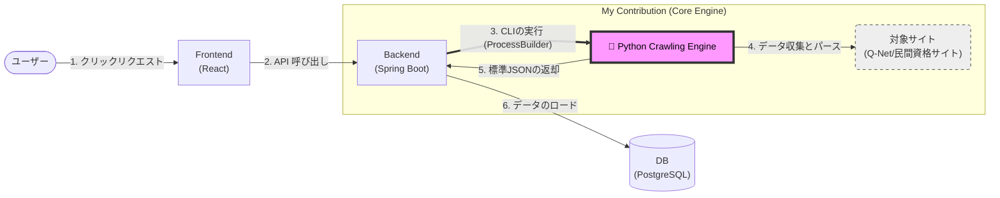
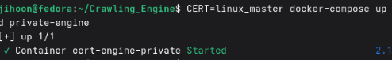
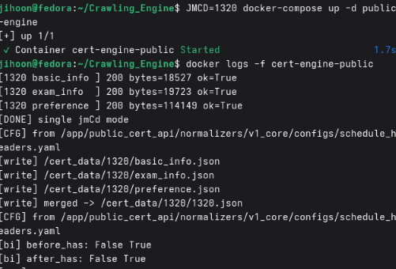
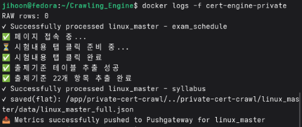
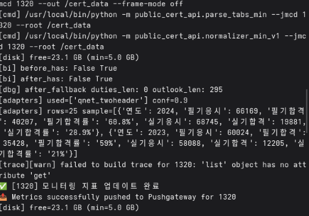
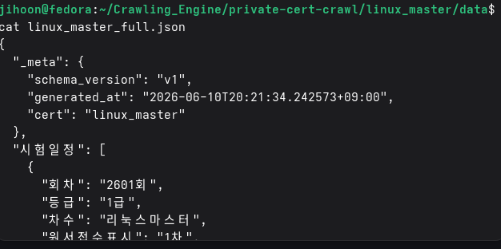
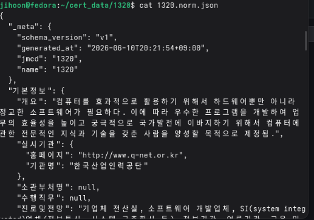
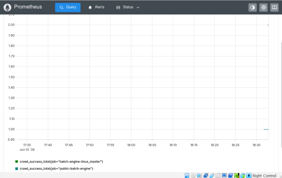
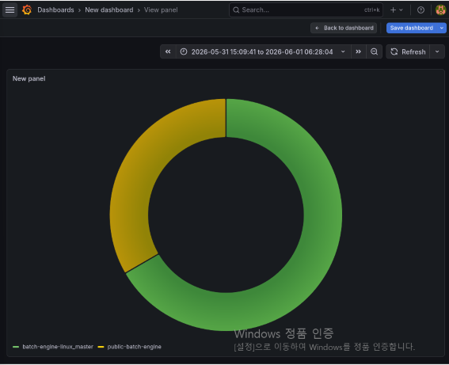
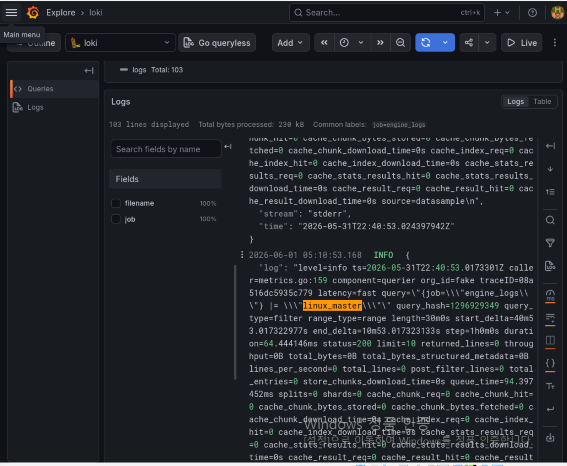

# Crawling Engine (Python)

公的資格・民間資格サイトの情報を自動収集・構造化し、**標準JSON出力**を生成するクローリングエンジンです。
運用観点における**「例外処理・エラー制御（タイムアウト／再試行／スナップショット）」**と、**ログベースの再現性／トラブルシューティング**を最優先に設計しました。

Pipeline: fetch → parse → normalize → output(JSON)

## 🧑‍💻 Core Contributions (貢献度)
- **Lead Developer ([Lee Jihoon])**:
    - プロジェクト全体のアーキテクチャ設計およびコア・クローリングエンジンロジックの実装（全コードの95%以上を担当）
    - 600以上の資格サイトに対応するためのマルチルールエンジンの開発
    - Dockerベースの統合インフラおよび運用環境の構築（PostgreSQL、Selenium Gridの最適化）

> [!IMPORTANT]
> ### 📢 Notice: Intellectual Property Protection (Patent Pending)
> * 本プロジェクトに適用されている**「非構造化データ対応マルチルールエンジン」**ロジックは、現在**特許出願手続き中**にあります。
> * 600以上の資格サイト（Q-Net等）のそれぞれ異なる構造を統合処理する独自技術が含まれており、無断盗用および商業的利用を禁じます。

## 📌 プロジェクト概要
- 資格情報が複数のサイトに分散しており、管理が困難であるという課題からスタート
- 公的資格・民間の資格データを標準JSON構造へ統合・一元化
- 例外処理（エラー制御）と再処理を考慮したクローリングパイプラインの設計

## 📦 成果物 (Output)
- 成果物は、特定の作業ルート（`--root`）配下に生成されます
  - 例: `Certificate_api/1320/1320.norm.json`

## ⚙️ 設計のポイント (Architecture Points)
- 公的資格（Q-Net）／民間サイトの**「構造的な違いをパイプラインレベルで分離」**し、拡張性を確保
- adapter / util レイヤーに切り分けることでルールを分離し、**「保守性とデータ品質」**を最優先
- **「タイムアウト・再試行・スナップショット（HTML保存）・重複除去」**による徹底した失敗ケースの制御

## コード読み込みガイド
- `public_cert_api/` : 公的機関(Q-Net)クローラー集
- `private-cert-crawl/` : 民間/私設クローラー集

## セキュリティ
- クッキー、トークン、アカウント情報はリポジトリにコミットしません。(`cookies.txt`、`.env` などは `.gitignore` で処理)
- 過度なトラフィックを誘発しないよう、リクエスト間隔および再試行(リトライ)回数を制限しています。


---

## 詳細設計の背景および問題解決プロセス

### 1. プロジェクト開始の背景

Q-Net（キューネット）や資格証ネットなどの既存の資格試験サイトは 日程、試験情報、CBT機能がそれぞれ分散しており
ユーザーが関心のある資格だけを集めて一目で管理することが難しいという不便さがありました。

そこで、チームメンバーとの議論の末、単に情報を集めることにとどまらず、データを正規化し
インフラを直接構築する経験を積みたいという思いから、

資格試験の日程・試験情報・CBT・お気に入り機能を一つのサービスに統合して提供しようという結論に至り, 
これを卒業作品のテーマに選定しました。

---
## 2. 課題 ① クローリングパイプラインの設計

最初に直面した課題は、単なるクローリングの実装ではなく、
**「インターネット上に分散した情報を、どのような構造で収集・整理するか」**という設計の領域でした。

そこで、
**fetch (HTML収集) → parse (JSON変換) → normalize (正規化およびDB格納)**
以下のような共通パイプラインを基準に全体のアーキテクチャを設計しました。

また、サイトごとに異なるHTMLの構造や規則の差異を吸収するため、**「adapter階層」**を導入しました。
これにより、不要な文字の除去、空値（Null値）の処理、フォーマットの統一といった共通処理は**「utilスクリプト」**として分離し、
効率的に管理できるようにしました。

---

### 3. 課題 ② 公的資格・民間資格におけるデータ構造の違い

公的資格（Q-Net）と民間資格サイトは、データ構造および信頼性の面で 性質が大きく異なっていました。

この問題を解決するため、両者を同一のルールで 処理せず、パイプラインレベルで分離する設計を採用しました。

民間資格は構造が比較的安定しているため自動化の比率を高め、Q-Netについては「自動化可能な領域」と「手動検証が必要な領域」を 明確に区別して アプローチしました。

その結果、約 **80〜90%** のデータ整合性を確保し、完全な自動化よりも「運用可能性」と「データ品質」を優先する方針で実装範囲を設定しました。

当初は完全自動化を目指して取り組みましたが、Q-Netの不規則なデータ構造に直面して検討を重ねた結果、**「完全な自動化よりもデータの品質が 最優先」**であると 再認識することになりました。
これに伴い、複雑なアーキテクチャ設計の過程でGPTとも試行錯誤を重ね、AIが提案する効率的なコードと、自分が考える保守性のバランスを見極めながら、AIに依存せず最終決定を下すエンジニアとしての役割と責任を学びました。


### 4. 問題 ③ クローリングエンジンの活用
サービス全体のうち、**Core Crawling Engine（Python）** 部分を専任で開発しました。  
Spring Bootと**ProcessBuilder(CLI)**方式で連携し、オンデマンド(On-demand)リクエスト時に実行されます。


```mermaid
flowchart LR
    User([ユーザー]) -->|1. クリックリクエスト| Client["Frontend<br/>(React)"]
    Client -->|2. API 呼び出し| Server["Backend<br/>(Spring Boot)"]
    
    subgraph "My Contribution (Core Engine)"
    Server == "3. CLIの実行 (ProcessBuilder)" ==> Python["🐍 Python Crawling Engine"]
    Python -->|4. データ収集とパース| Sites("対象サイト<br/>(Q-Net/民間資格サイト)")
    end
    
    Python -- "5. 標準JSONの返却" --> Server
    Server -->|6. データのロード| DB[("DB<br/>(PostgreSQL)")]
    
    style Python fill:#f9f,stroke:#333,stroke-width:4px,color:black
    style Sites fill:#eee,stroke:#333,stroke-dasharray: 5 5
```

### 4-2. 課題④: パーサーエンジンの高度化とデータ整合性の確保

9つの民間資格とQ-Net（公的資格）パイプラインのデータ精度およびシステムパフォーマンスを改善するために実施したリファクタリングのプロセスです。単にコードを修正するにとどまらず、環境間の干渉を最小限に抑え、データ品質を標準化することに注力しました。

* **発生した課題と技術的負債 (Technical Debt)**
   - **パースのボトルネック**：既存の `html.parser` エンジンが大容量DOM構造を処理する際に発生するパフォーマンス低下および特殊タグの解析エラーを確認
   - **データ汚染の残存**：公的/民間サイトの非構造化HTMLから流入する不要なタグ、特殊文字、異常な空白が最終的なJSON結果に含まれ、データ品質を低下させていた

* **エンジニアリング的解決策 (Engineering Solutions)**
   - **汎用パースエンジン（lxml）の導入**: 公的/民間のクローラー全体に `lxml` エンジンを全面適用し、パース速度を最適化。例外的なタグ構造に対する柔軟な対応力を確保
   - **中央集権型クレンジングモジュールの構築（民間）**: `engine_common/utils_text.py` 内に独立した `sanitize_text` 関数を設計。これにより、すべてのサブモジュールが同一のクレンジング規則に従う中央制御型アーキテクチャを実現
   - **公的パイプライン（Q-Net）の高度化**: 公的資格のコアロジックである `parse_tabs_min.py` に `sanitize_text` を統合適用し、数十個の試験タブから抽出されるテキストの品質を一括で正規化
   - **民間パイプラインの全面リファクタリング**：9つの民間資格個別クローラーの `get_text` オプションを標準化し、二重フィルタリングロジックを移植することで、成果物データの整合性（Data Integrity）を達成

* **段階的リファクタ링戦略 (Incremental Refactoring)**
  - **統合標準化** : 異なる構造を持つ公的/民間プロジェクトが `engine_common` ユーティリティを共有することで、**コードの重複排除と保守性の最大化**を実現
  - **環境間の整合性検証**：Fedora（Linux）と Windows 環境の双方で同一のクレンジング結果が得られるよう環境依存性を排除し、全数テストをクリア

> **「単なるクローリングにとどまらず、公的・民間のデータパイプラインを一つの洗練された標準に統合することで、システムの拡張性とデータの信頼性を 同時に確保しました。」**


## 5. Dockerベースの統合インフラとマルチプラットフォーム対応

本プロジェクトは単なるコード実装にとどまらず、**「どのような環境でも即座にデプロイ・実行可能なエンジン」**を構築するために、Dockerベースの統合インフラを導入しました。これにより、WindowsとLinux間の環境依存性の問題を完全に解決しました。

| 項目 | 詳細内容 |
| :--- | :--- |
| **対応 OS** | Windows 10/11 (Docker Desktop), Fedora Linux (Docker Engine) |
| **インフラ標準化** | Docker Imageの活用によるライブラリの断片化防止および `psycopg2-binary==2.9.11` 適用による OS 別の依存関係衝突を解消 |
| **リソース最適化** | Shared Memory (2GB)の割り当てにより、大容量資格データの収集安定性を確保 |
| **構造的柔軟性** | Host Volume Bindingを通じて既存のフォルダ構造を維持し、コンテナとデータを同期 |
| **検証完了** | 公的(Q-Net)および民間(KAIT)資格データの正規化テストに合格 |

* **主要なエンジニアリング意思決定 (Decision & Rationale)**
  - **設計の一貫性**: プロジェクトの既存フォルダおよびファイル構造を強制的に変更せず、`docker-compose.yml` のボリュームマッピング機能を精巧に設計し、ホストのソースコードをコンテナ内部のパスに直接接続しました。これにより、開発生産性を維持しつつ、運用環境の独立性を確保しました。
  - **環境の制約克服**: Linux（Fedora）環境における厳格なセキュリティポリシー（SELinux）を考慮して `:z` フラグを導入し、Headless Chromeブラウザの慢性的なメモリ不足（Tab Crashed）問題をインフラレベル（`shm_size`）で根本的に解決しました。

単に「動作するコード」を作るのではなく、特定のOSに依存せずあらゆる運用環境（Linux等）で確実に稼働するエンジンの構築に注力しました。
特に Windows と Fedora 間におけるライブラリ衝突（`psycopg2-binary`）を解決する過程で、インフラ環境に応じた適切な依存関係管理の重要性を実感しました。

---

> **「本プロジェクトは、単にデータを収集するスクリプトではありません。Windowsで開発しLinuxサーバーへデプロイする実際の現場パイプ라인をDockerで標準化し、『コマンド1行』で全てのシステムが即座に稼働するよう設計された、再現性の高いエンジニアリングの成果物です。」**


## 6. データ収集およびエンジンパイプラインの実行プロセス

本エンジンは、民間および公的領域の異なるターゲットサイトを対象に、 データの収集・クレンジング・モニタリングを行うパイプライン全体の実行プロセスです。 各アーキテクチャは、対象サイトの特性に応じて独立して稼働します。

---

### 🔄 6-1. クローリングバッチの稼働 (Execution)
> **Pythonベースのデータ収集バッチを起動する段階です。対象ドメインの特性に合わせて最適化されたスクリプトが実行されます。**

#### 🔹 A. 民間資格収集エンジン

* **構造化データの抽出**：民間資格のスケジュールおよび詳細ページのHTML構造を精密に解析し, 必要な 資格情報のみを正確に抽出します。

#### 🏛️ B. 公的資格収集エンジン

* **大量データの収集安定性:** 大量の国家資格データを 保有した 公的プラットフォームの特性を考慮し、ターゲットサーバーへの過度な負荷やアクセス遮断（IPブロック等）を防止するため、リクエスト間隔の制御および安定したセッション回避メカニズムを実装し、安全にデータを収集します。

---

### 📄 6-2. リアルタイムクローリングログの確認 (Runtime Log)
> **収集プロセスの進行に伴い、リアルタイムでコンテナおよびファイルシステムに記録される標準出力（stdout）ログです。**

#### 🔹 A. 民間収集エンジンのリアルタイムログ

* **定型化されたロギング:** 民間資格の内容、スケジュール、収集の成功可否が構造化されたフォーマットで出力され、正常な稼働状態をリアルタイムで示します。

#### 🏛️ B. 公的収集エンジンのリアルタイムログ

* **トラフィックおよび応答の追跡:** Q-Netの各タブごとの成功可否や、バッチスケジューリングの進行状況をリアルタイムで記録し、漏れのないログ収集基盤を確保します。
---

### 📦 6-3. 最終クレンジングデータの出力 (JSON Result)
> **収集完了後、データの 欠損なく 最終的に整形（Parsing）されて保存された構造化データファイルです。**

#### 🔹 A. 民間データの最終出力結果 (JSON)

* **データモデリング:** 民間サイトの非構造化データを分析ターゲットに合わせてキー・バリュー（Key-Value）形式で精密にパースし、標準の `JSON` フォーマットで構造化した例です。

#### 🏛️ B. 公的データの最終出力結果 (JSON)

* **標準規格への整形:** 様々な形式で散在していた公的機関の基礎データを、一貫したデータスキーマ規則に合わせて損失なく変換・永続化した例です。

* **データ構造化:** 収集された非構造化データが、エンドポイントとの連携および可読性を 考慮して 標準の `JSON` フォーマットへ損失なく変換・保存された状態です。

---

### 📊 6-4. Prometheusメトリクス収集連携 (Metric Exporter)
> **正常に終了したバッチ結果および収集メトリクスデータが、Prometheus（時系列データベース）に正常に収集・記録されている様子です。**



* **時系列データの収集:** パイプラインの成功率や所要時間などのメトリクスが、エクスポーター（Exporter）を通じて Prometheus の Target に正常にスクレイピング（Scraping）されていることを証明します。
---


## 7. Prometheus & Loki ベースの統合モニタリングおよびログ中央集権化の構築

本プロジェクトが本番環境（Actual Production Environment）で安定して稼働しているかをリアルタイムで visual に監視し、例外ログを追跡するため、インフラモニタリングシステムを連携しました。

### 📊 7-1. リアルタイムバッチ稼働およびクローリング成功率ダッシュボード (Grafana)
> **バッチエンジンの稼働状態、タスク別の成功/失敗率、 systems リソース（CPU/メモリ）消費量をリアルタイムで可視化したダッシュボード画面です。**



* **ドーナツチャートによるメトリクス観測:** 収集された資格情報スケジュールおよびリアルタイムクローラーバッチパイプラインの成功率を即座に把握できるよう、時系列（Time-series）データをドーナツチャート形式で可視化・構成しました。

---

### 💻 7-2. 分散コンテナのリアルタイムログ収集状態 (Loki & Promtail)
> **コンテナ内部およびパイプライン全体で発生する大量のテキストログをリアルタイムでインデックス化し、統合観測・管理する画面です。**



* **障害追跡の最適化:** エラー発生時にファイルサーバーへ個別にアクセスする必要がなく、GrafanaのWebコンソール上で `error` キーワードフィルタリングを通じて、システムの例外 原因を秒単位で追跡・デバッグできる環境を確保しました。

---

### 📑 メトリクスおよびログ収集アーキテクチャ

* **Prometheus & Pushgateway:** クローラーパイプラインのメトリクス（作業成功率、所要時間等）をリアルタイムで収集・保存
* **Grafana:** 収集されたメトリクスデータを可視化し、ダッシュボードを通じてシステム状態を monitoring(モニタリング)
* **Promtail & Loki:** コンテナ内部および system から発生するログデータを中央集権型で収集・インデックス化し、迅速なエラーデバッグ環境を確保

---

### 💡 主要なエンジニアリング意思決定 (Decision & Rationale)

* **システムの可視性(Visibility)確保:** テキストログを個別に確認していた従来の方式から脱却し、Grafanaダッシュボードを通じてCPU/メモリ資源およびパイプラインの状態を視覚的に  一目で把握できるよう高度化しました。
* **障害追跡時間の大幅短縮:** LokiとPromtailの導入により、分散されたコンテナのログを一箇所に 集約し、システム例外の発生時に原因分析およびトラブルシューティング(Troubleshooting)にかかる時間を大幅に短縮しました。

## 8. 環境設定ガイド (Environment Setup)

本プロジェクトは、スムーズな開発および運用のために2つの実行環境を提供します。

* **Option 1 (仮想環境):** コード修正およびローカルテストなど、**開発段階での迅速なフィードバック**のために使用します。
* **Option 2 (Docker):** 実際の運用環境と同等の conditional(条件)で**エンジンをデモンストレーション・配包(デプロイ)する際**に使用し、環境依存性なく即座に実行可能です。（推奨）

## 1. Linux (Fedora 基準)
1. **システムパッケージのインストール**
   ```bash
   sudo dnf install gcc postgresql-devel
   ```

2. **仮想環境の構築および依存関係のインストール**
   ```bash
   python3 -m venv .venv
   source .venv/bin/activate
   python -m pip install --upgrade pip
   pip install -r requirements.txt
   ```

3. **仮想環境の有効化**
   ```bash
   source .venv/bin/activate
   ```

4. **エンジンの実行 (仮想環境で公的資格データを抽出)**
   ```bash
   python -m public_cert_api.run_public --root "../cert_data" --jmcd 1320 --mode http
   ```

5. **エンジンの実行 (仮想環境で民間資格データを抽出)**
   ```bash
   python run_once.py --cert [資格名] --config private-cert-crawl/configs/cert_map.yaml
   # 예: linux_master
   ```

6. **Dockerのインストール (Linux 基準)**
   ```bash
   # 1. Docker および Docker Compose のインストール
   sudo dnf install -y docker docker-compose

   # 2. Docker サービスの起動および OS 起動時の自動実行設定
   sudo systemctl start docker
   sudo systemctl enable docker

   # 3. (任意) sudo なしで Docker を run(実行)するためのユーザーグループ追加
   sudo usermod -aG docker $USER
   # ※ 設定後、再ログインすることで group(グループ)権限が適用されます。
   ```

7. **エンジンのビルド (初回またはコード修正時)**
   ```bash
   docker compose build
   ```

8. **エンジンの実行 (Docker環境で公的資格データを抽出)**
   ```bash
   JMCD=1320 docker-compose up -d public-engine
   ```

9. **エンジンの実行 (Docker環境で民間資格データを抽出)**
   ```bash
   CERT=linux_master docker-compose up -d private-engine
   ```

10. **全種目の一括収集**
    ```bash
    while read -r jmcd; do 
         echo "▶️ 現在収集中の種目コード: $jmcd"
         JMCD=$jmcd docker-compose up public-engine
    done < others.txt
    ```

12. **セキュリティおよび権限管理**
    ```bash
    # 1. 所有権の変更 (現在のユーザーに 指定)
    sudo chown -R $USER:$USER ~/cert_data

    # 2. ディレクトリ権限 (755): リスト照会および進入を許可
    find ~/cert_data -type d -exec chmod 755 {} +

    # 3. ファイル権限 (644): 読み取り/書き込みを許可 (実行防止)
    find ~/cert_data -type f -exec chmod 644 {} +

    # 4. SELinux セキュリティラベル (Fedora 等の特定環境で必要な場合) 
    sudo chcon -Rt svirt_sandbox_file_t ~/cert_data
    ```     

## 1. Windows
1. **Python のインストール**
   ```bash
   winget install Python.Python.3.11
   ```

2. **仮想環境の構築および依存関係の インストール**
   ```bash
   python -m venv .venv
   .\.venv\Scripts\Activate.ps1
   python -m pip install --upgrade pip
   python -m pip install -r requirements.txt
   ```

3. **仮想環境の有効化**
   ```bash
   .\.venv\Scripts\activate
   ```
   
4. **エンジンの実行 (仮想環境で公的資格データを抽出)**
   ```bash
   python -m public_cert_api.run_public --root "../cert_data" --jmcd 1320 --mode http
   ```

5. **エンジンの実行 (仮想環境で民間資格データを抽出)**
   ```bash
   python run_once.py --cert [資格名] --config private-cert-crawl/configs/cert_map.yaml
   # 예: linux_master
   ```

6. **Windows 環境**
   - **Docker Desktop のインストール**: Docker 公式ウェブサイトから setup ファイルをダウンロードしてインストールします。
   - **仮想化設定**: BIOS で Virtualization (VT-x/AMD-V) が有効化されている必要があり、WSL2 ベースの設定を推奨します。
   - **実行確認**: ターミナルで コマンドを入力する前に、必ず Docker Desktop アプリを起動し「Engine Running」状態であることを確認してください。

7. **エンジンの実行 (Docker環境で公的資格データを抽出)**
   ```bash
   $env:JMCD="1320"; docker-compose up -d public-engine
   ```

8. **エンジンの実行 (Docker環境で民間資格データを抽出)**
   ```bash
   $env:CERT="linux_master"; docker-compose up -d private-engine
   ```


9. **全種目の一括収集(Windows 環境は Docker のファイルシステム同期の特性上、大量収集時に速度が大幅に低下する可能性があるため、なるべく Linux 環境での実行を推奨します.)**
   ```bash
   foreach ($jmcd in Get-Content others.txt) {
      Write-Host "▶️ 現在収集中の種目コード: $jmcd"
      $env:JMCD = $jmcd.Trim()
      docker-compose up public-engine
   }
   ```
